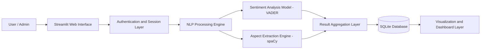
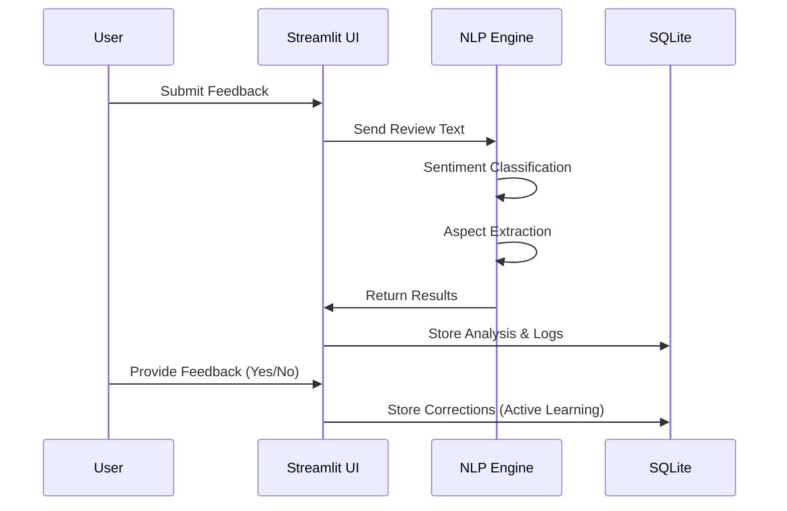
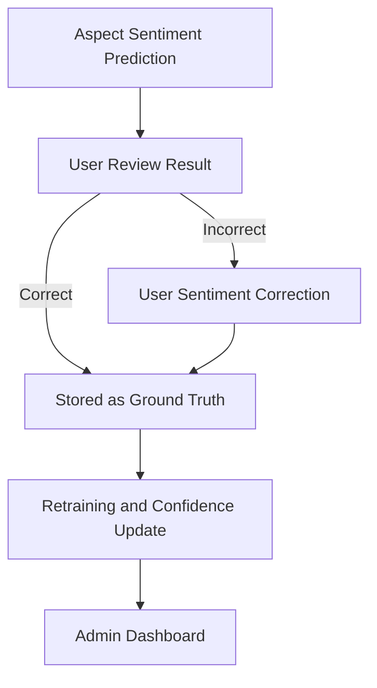

# 🧠 Review-sense-extraction-feedback

## 📌 Overview

**ReviewSense** is an **Aspect-Based Sentiment Analysis (ABSA)** platform designed to extract **fine-grained sentiment insights** from unstructured customer reviews.

Unlike traditional sentiment analysis that assigns a single sentiment to an entire review, ReviewSense:
- Identifies **specific aspects** (e.g., *battery*, *food*, *delivery*)
- Assigns **individual sentiment labels**
- Computes **confidence scores**
- Enables **human correction through Active Learning**
- 🔁 **Active Learning (Human-in-the-Loop Correction)**
- 🔧 **Admin Dashboard & System Analytics**
- 📊 **Confidence-based retraining simulation**
- 🔐 **Role-based authentication (User & Admin)**

The system is implemented as an **interactive Streamlit web application** with **SQLite** as the persistence layer.

---

## 🏗️ System Architecture

### High-Level Architecture

### 🏗️ System Architecture Explanation

The architecture of **ReviewSense** follows a **layered and modular design**, ensuring clarity, scalability, and ease of maintenance. Each component has a well-defined responsibility in the end-to-end sentiment analysis pipeline.

- **User & Interface Layer**  
   A unified Streamlit web interface for users and admins, enabling review input, dataset upload, analysis, and dashboards with role-based access.

- **Authentication & Access Control**  
   Manages secure login, session handling, and controlled access to user and admin features.

- **NLP Processing Layer**  
   Core intelligence layer handling text preprocessing, aspect extraction (spaCy), sentiment analysis (VADER), and confidence scoring.

- **Data & Aggregation Layer**  
   Aggregates aspect-level sentiment results and stores users, analyses, feedback, and logs using an SQLite database.

- **Visualization & Analytics Layer**  
   Interactive dashboards presenting aspect-wise sentiment, confidence distributions, trends, and admin analytics.

## 🔄 Application Workflow

### End-to-End Processing Flow



---


---

## 🔄 End-to-End Workflow

1. User submits a **single review** or **CSV dataset**
2. System performs:
   - Aspect detection
   - Aspect–opinion pairing
   - Sentiment classification
   - Confidence estimation
3. Predictions with **confidence < 0.50** are automatically queued for **Active Learning**
4. User manually corrects sentiment and adjusts confidence
5. Corrected samples are stored as **ground truth**
6. Retraining applies corrections to future predictions
7. Admin monitors system usage, trends, and retraining history

---

## 🧩 Core Processing Pipeline

### 1️⃣ Aspect Identification
- Rule-based keyword matching
- spaCy dependency parsing
- Canonical aspect mapping

### 2️⃣ Opinion Extraction
- POS tagging for adjectives
- Lexicon-based opinion detection

### 3️⃣ Aspect–Sentiment Assignment
- Each aspect is paired with its nearest opinion
- Sentiment computed per aspect using **VADER**

### 4️⃣ Confidence Calculation
- Confidence = `max(pos, neg, neu)` from VADER
- Used to detect uncertainty

### 5️⃣ Active Learning Loop
- Low-confidence predictions (< 0.50) are flagged
- User corrections override future predictions
- Retraining events are logged for traceability

---

## 🔁 Active Learning Module





The **Active Learning** module enables **human-in-the-loop correction** to improve prediction quality.

### Key Characteristics
- Automatically queues low-confidence predictions
- Allows users to:
  - Correct sentiment labels
  - Adjust confidence scores
  - Provide feedback remarks
- Corrections are persisted in the database
- Retraining applies corrected labels to subsequent predictions

This approach minimizes labeling effort while continuously improving system accuracy.

---

## 👤 User Features

- Manual review sentiment analysis
- Aspect-level sentiment extraction
- Color-coded aspect highlighting
- Confidence visualization
- Dataset (CSV) analysis
- Active Learning correction interface
- Profile and analysis history management

---

## 🔧 Admin Panel Features

The **Admin Panel** provides centralized governance and monitoring.

### Admin Capabilities

**Authentication & Access**
- Dedicated Admin login
- Role-based access control (Admin-only views)

**User Management**
- View all registered users
- Remove users when required
- Monitor user activity logs

**System Analytics**
- Total users and datasets
- Total reviews analyzed
- Aspect-wise sentiment distribution
- Sentiment trends over time

**Active Learning Oversight**
- Monitor low-confidence predictions
- Track corrected vs uncorrected samples
- Export Active Learning data (CSV)
- View retraining history and sample counts

**Model Monitoring**
- Approximate accuracy estimation
- Confidence trend tracking
- Retraining event logs with timestamps

---

## 🗄️ Database Design

### Key Tables
- `users`
- `admins`
- `saved_analyses`
- `dataset_results`
- `active_learning_samples`
- `activity_logs`
- `model_retraining_logs`

All user actions, corrections, and retraining events are **persisted** to ensure transparency and traceability.

---

## 🛠️ Technology Stack

| Layer | Technologies |
|-----|-------------|
| Frontend UI | Streamlit |
| NLP Engine | spaCy |
| Sentiment Analysis | VADER |
| Active Learning | Human-in-the-loop feedback |
| Database | SQLite |
| Visualization | Altair |
| Security | SHA-256 Password Hashing |
| Language | Python |

---

## 🚀 Running the Project Locally

### Prerequisites
- Python **3.9 or above**
- pip package manager

### Setup & Run

```bash
git clone https://github.com/premabhishek/Review-sense-extraction-feedback.git
cd Review-sense-extraction-feedback
python -m venv venv
venv\Scripts\activate
pip install -r requirements.txt
python -m spacy download en_core_web_sm
streamlit run app.py
```

---


## 🌱 Open Source Contributions

This project is **open for contributions**.

We welcome:

- New aspect domains  
- Aspect keyword expansion  
- Active Learning strategy improvements  
- UI/UX enhancements  
- Performance optimization  
- Documentation improvements  

### How to Contribute

1. Fork the repository  
2. Create a feature branch  
3. Commit your changes  
4. Submit a pull request  

We appreciate all contributions that help improve the quality, usability, and robustness of the system.


---

## 📌 Professional Note

**ReviewSense** is designed as a **production-inspired academic system**, following best practices in:

- Modular and layered architecture  
- Secure authentication and role separation  
- Human-in-the-loop Machine Learning  
- Explainable and interpretable NLP outputs  
- Admin-driven monitoring and analytics  

The system prioritizes **correctness, transparency, and continuous improvement**, making it ideal for **academic evaluation, viva presentations, and real-world prototyping**.


---

